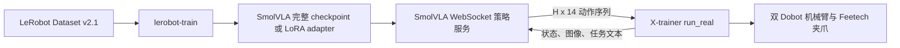

# X-trainer SmolVLA 实施计划

## 1. 文档目的

本文档用于规划 SmolVLA 在 X-trainer 双臂机器人上的训练与真机部署。每个“提交单元”对应一个可独立评审、测试和回滚的 Git 提交，后续按顺序逐项实施。

本项目采用以下固定决策：

- 策略模型固定为 SmolVLA，不迁移 LingBot-VLA 2.0 模型、Qwen3-VL 或其 checkpoint。
- 训练数据保持 LeRobot Dataset v2.1 格式，不转换、不覆盖、不改写为 v3.0。
- 复用现有 `lerobot-train` 训练循环、SmolVLA 实现和 PEFT/LoRA 能力。
- X-trainer 真机环境、硬件驱动、WebSocket 协议和运行循环统一以 [GC-SHIRO/X-Trainer-LingBot-VLA2.0: Implementation of LingBot-VLA2.0 at X-Trainer platform](https://github.com/GC-SHIRO/X-Trainer-LingBot-VLA2.0) 为目标参考仓库，并尽量维持其原有接口。
- 第一版真机推理继续使用 WebSocket 二进制帧、MessagePack 和 NumPy 编码，不接入 LeRobot gRPC 异步推理框架。
- Action chunk 管理遵从 SmolVLA 论文原版异步推理逻辑，而非简单的双缓冲边界切换：使用单一按绝对 timestep 标记的动作队列；当队列剩余动作比例低于阈值 `g`（默认 0.7，对应 `chunk_size=50` 时约提前 15 步触发）时采集最新观测并发起非阻塞推理；新 chunk 返回后按绝对 timestep（而非估算耗时）丢弃已过期动作；与旧队列重叠的时间步采用固定权重 `0.3 * old + 0.7 * new` 加权融合；融合结果立即替换未来动作队列，不必等旧 chunk 耗尽。任意时刻最多保留一个未完成推理请求。安全限幅在融合之后单独执行，不参与加权计算。第一版不实现 RTC（Real-Time Chunking）式的去噪期约束。

## 2. 固定系统契约

### 2.1 状态与动作布局

`observation.state` 和 `action` 均为 14 维，顺序固定如下：


| 索引   | 含义         | 单位或范围         |
| -------- | -------------- | -------------------- |
| `0:6`  | 左臂关节 1-6 | 弧度，绝对关节位置 |
| `6`    | 左夹爪       | 归一化到`[0, 1]`   |
| `7:13` | 右臂关节 1-6 | 弧度，绝对关节位置 |
| `13`   | 右夹爪       | 归一化到`[0, 1]`   |

数据集加载器、SmolVLA processor、策略服务端和真机客户端必须保持这一顺序。任何组件都不能依赖字典插入顺序推断动作含义。

### 2.2 数据字段

数据集与部署统一使用：

```text
observation.state
observation.images.top
observation.images.left_wrist
observation.images.right_wrist
action
task
```

### 2.3 相机配置

三台 RealSense 的默认序列号固定如下，同时保留 CLI 覆盖能力，方便后续更换设备：


| 相机     | CLI 参数                      | 序列号         | 观测字段                         |
| ---------- | ------------------------------- | ---------------- | ---------------------------------- |
| 顶部相机 | `--camera-top-serial`         | `409122273405` | `observation.images.top`         |
| 左腕相机 | `--camera-left-wrist-serial`  | `412622272997` | `observation.images.left_wrist`  |
| 右腕相机 | `--camera-right-wrist-serial` | `412622271417` | `observation.images.right_wrist` |

### 2.4 总体部署流程



## 3. 提交单元 1：建立 X-trainer 配置契约

### 目标

先建立训练与部署共享的声明式配置，固定字段名、维度、相机序列号、网络参数和控制参数，为后续模块提供统一依据。

### 计划文件

```text
configs/xtrainer/train_smolvla.yaml
configs/xtrainer/train_smolvla_lora.yaml
configs/xtrainer/deploy.yaml
```

### 实施内容

- 配置 LeRobot v2.1 数据集的 repo ID、根目录占位值和 `format_version: v2.1`。
- 配置 `policy.type: smolvla` 和预训练 SmolVLA base checkpoint。
- 全量微调与 LoRA 使用独立配置及输出目录。
- 在 `deploy.yaml` 中写入三台相机的默认序列号。
- 写入目标参考仓库 [GC-SHIRO/X-Trainer-LingBot-VLA2.0: Implementation of LingBot-VLA2.0 at X-Trainer platform](https://github.com/GC-SHIRO/X-Trainer-LingBot-VLA2.0) 已有的左右臂 IP、夹爪串口、夹爪 ID、控制频率、图像尺寸、动作长度与安全阈值。
- 明确 14 维状态和动作顺序。
- 不在配置中存储 Hugging Face token 或其他凭据。

### 验收标准

- 三个 YAML 文件均可成功解析。
- 全量训练与 LoRA 配置只在训练方式需要的字段上不同。
- 三台相机序列号与 14 维 schema 有明确且唯一的配置来源。
- 不改变现有 LeRobot 行为。

### 建议提交信息

```text
feat(xtrainer): 添加 SmolVLA 训练与部署配置
```

## 4. 提交单元 2：增加 LeRobot v2.1 只读数据适配器

### 目标

允许当前以 v3.0 为主的仓库直接读取现有 LeRobot Dataset v2.1 数据进行训练，同时保证源数据不被转换或修改。

当前核心数据集代码将 `CODEBASE_VERSION` 固定为 `v3.0`，并有意拒绝 v2.1。因此应增加显式兼容适配器，不能削弱全局版本检查。

### 计划文件

```text
src/lerobot/datasets/v21/__init__.py
src/lerobot/datasets/v21/metadata.py
src/lerobot/datasets/v21/dataset.py
tests/datasets/v21/test_metadata.py
tests/datasets/v21/test_dataset.py
```

### 实施内容

- 只读加载 v2.1 的 `meta/info.json`、`meta/stats.json`、`meta/tasks.jsonl`、`meta/episodes.jsonl`、逐 episode Parquet 与 MP4 文件。
- 对训练与 policy factory 暴露必要接口：
  - `__len__`
  - `__getitem__`
  - `meta.features`
  - `meta.stats`
  - `meta.fps`
  - `meta.camera_keys`
  - `meta.total_episodes`
  - episode 与 task 元数据
  - delta timestamp 查询
- 根据 SmolVLA 的 action delta indices 构建动作 chunk。
- 在 episode 尾部正确 padding，并返回训练流程所需的 padding mask。
- 按请求时间戳解码三路相机视频。
- 输出现有 SmolVLA processor 可直接处理的 tensor 和 task 文本。
- 对不支持或含义不明确的 v2.1 变体给出清晰错误，不试图兼容所有历史格式。

### 验收标准

- 含两个 episode 的 v2.1 fixture 可正确读取，并不会跨 episode 取动作。
- 状态和动作保持固定的 14 维顺序。
- 三路图像能定位到正确 episode 和时间戳。
- task index 能解析为正确任务文本。
- episode 尾部 action padding 与 mask 正确。
- 测试确认源数据文件未被修改。

### 建议提交信息

```text
feat(datasets): 添加 LeRobot v2.1 只读适配器
```

## 5. 提交单元 3：在 Dataset Factory 中接入 v2.1

### 目标

通过标准 `lerobot-train` 配置选择 v2.1 适配器，同时保持现有 v3.0 路径完全不变。

### 计划文件

```text
src/lerobot/configs/default.py
src/lerobot/datasets/factory.py
tests/datasets/test_factory_v21.py
```

### 实施内容

- 增加范围明确的数据集格式选择字段，默认仍走 v3.0。
- `dataset.format_version: v2.1` 时构建 v2.1 metadata 与 dataset adapter。
- 在兼容范围内复用现有 image transform 和 delta timestamp 解析逻辑。
- 第一版不支持 v2.1 streaming 和 multi-dataset；若配置中启用则提前报错。
- 不修改 `CODEBASE_VERSION`、v3.0 metadata loader 和官方转换脚本。

### 验收标准

- X-trainer 训练配置能选择 v2.1 adapter。
- 现有 v3.0 dataset factory 测试保持通过。
- v2.1 数据不会误入 v3.0 loader。
- 不支持的 v2.1 组合会返回明确配置错误。

### 建议提交信息

```text
feat(training): 将 v2.1 数据接入训练工厂
```

## 6. 提交单元 4：增加 X-trainer v2.1 数据校验工具

### 目标

在启动 GPU 训练前快速发现 schema、视频、时间戳和数值异常。

### 计划文件

```text
scripts/xtrainer/validate_dataset_v21.py
tests/xtrainer/test_validate_dataset_v21.py
```

### 实施内容

- 校验数据版本为 LeRobot `v2.1`。
- 校验 metadata、episode Parquet 和视频文件是否齐全。
- 校验 state、action、三路 image、timestamp、index 和 task 字段。
- 校验 state/action 均为 14 维，且不存在 NaN 或 Inf。
- 校验夹爪范围；对异常关节范围发出报告，但不静默裁剪训练数据。
- 校验相机名称、视频可读性、帧时间戳、FPS 和抽样图像尺寸。
- 校验 normalization stats 覆盖 state 和 action。
- 支持快速抽样扫描与可选完整扫描。
- 失败时返回非零退出码，成功时输出简洁统计摘要。

### 验收标准

- 测试覆盖缺失相机、错误动作维度、无效 task index、NaN 和视频缺失。
- 校验过程不写入 metadata、Parquet、视频或 stats。
- 有效 fixture 校验成功并输出 episode 与 frame 数量。

### 建议提交信息

```text
feat(xtrainer): 添加 v2.1 数据校验命令
```

## 7. 提交单元 5：增加 SmolVLA 全量训练启动脚本

### 目标

围绕现有 `lerobot-train` 提供可复现的训练入口，不复制训练循环。

### 计划文件

```text
scripts/xtrainer/train_smolvla.sh
scripts/xtrainer/train_smolvla.ps1
docs/source/xtrainer_smolvla.mdx
```

### 实施内容

- 默认在训练前运行 v2.1 数据校验，可显式跳过。
- 使用 `configs/xtrainer/train_smolvla.yaml` 调用 `lerobot-train`。
- 支持覆盖 dataset root、输出目录、device、batch size、steps 和 resume checkpoint。
- Linux shell 与 Windows PowerShell 脚本保持参数语义一致。
- 文档说明 v2.1 目录结构和必需字段。
- 优先提供单 GPU 用法，仅暴露仓库已经支持的分布式参数。

### 验收标准

- 两个启动脚本均提供帮助信息，并拒绝不存在的数据目录。
- 最小训练 smoke test 能完成 forward、backward 和 checkpoint 保存。
- 不引入自定义训练循环。

### 建议提交信息

```text
feat(xtrainer): 添加 SmolVLA 全量训练入口
```

## 8. 提交单元 6：增加 SmolVLA LoRA 训练配置与入口

### 目标

将仓库现有 PEFT 能力封装为经过验证的 X-trainer LoRA 工作流。

### 计划文件

```text
configs/xtrainer/train_smolvla_lora.yaml
scripts/xtrainer/train_smolvla_lora.sh
scripts/xtrainer/train_smolvla_lora.ps1
tests/xtrainer/test_smolvla_lora_config.py
docs/source/xtrainer_smolvla.mdx
```

### 实施内容

- 从预训练 SmolVLA checkpoint 开始训练。
- 第一版配置采用：

```yaml
peft:
  method_type: LORA
  r: 64
  lora_alpha: 64
```

- 使用 SmolVLA 已有默认 target modules，不增加复杂 target 正则。
- 禁用 EMA，并拒绝与 LoRA 不兼容的分片并行配置。
- Adapter 使用独立于全量微调的输出目录。
- 文档说明 base model 与 adapter 的部署关系。
- Smoke test 检查可训练参数主要为 adapter 和预期的任务相关投影层。

### 验收标准

- 最小 LoRA 训练能保存 `adapter_model.safetensors`、`adapter_config.json`、policy config 和 processors。
- 保存的 adapter 能在其声明的 base model 上重新加载。
- 全量训练配置不受影响。

### 建议提交信息

```text
feat(xtrainer): 添加 SmolVLA LoRA 训练流程
```

## 9. 提交单元 7：迁移 WebSocket 与 MessagePack 传输层

### 目标

先将目标参考仓库 [GC-SHIRO/X-Trainer-LingBot-VLA2.0: Implementation of LingBot-VLA2.0 at X-Trainer platform](https://github.com/GC-SHIRO/X-Trainer-LingBot-VLA2.0) 的部署协议迁移为独立模块，再接入 SmolVLA 推理。

### 计划文件

```text
deploy/xtrainer/__init__.py
deploy/xtrainer/msgpack_numpy.py
deploy/xtrainer/websocket_policy_server.py
deploy/xtrainer/websocket_client_policy.py
tests/xtrainer/test_websocket_transport.py
```

### 实施内容

- 迁移 WebSocket 二进制请求/响应和 NumPy MessagePack 编解码。
- 保留 metadata 握手和 `GET /healthz`。
- 保持一次请求对应一次响应。
- 增加简单的协议版本和 schema metadata，不重新设计传输层。
- 拒绝 object、complex、非法 shape、超大载荷和缺失字段。
- 第一版不实现认证和 TLS，明确仅用于可信局域网。
- 不导入任何 LingBot-VLA 模型代码。

### 验收标准

- NumPy 数组往返后 dtype 和 shape 保持一致。
- 健康检查和 metadata 握手正常。
- 非法载荷返回受控错误，不导致服务进程退出。
- 测试不依赖 GPU 或机器人。

### 建议提交信息

```text
feat(deploy): 添加 X-trainer WebSocket 传输层
```

## 10. 提交单元 8：增加 SmolVLA 策略服务适配器

### 目标

加载完整 SmolVLA checkpoint 或 LoRA adapter，并向迁移后的 WebSocket server 暴露简单的 `reset()` 与 `infer()` 接口。

### 计划文件

```text
deploy/xtrainer/smolvla_policy.py
scripts/xtrainer/serve_policy.py
tests/xtrainer/test_smolvla_policy.py
```

### 实施内容

- 使用现有 LeRobot API 加载 policy config、checkpoint、preprocessor 和 postprocessor。
- 通过 adapter config 识别 PEFT checkpoint，先加载声明的 base model，再加载 adapter。
- 请求固定包含 X-trainer 的 state、三路 image 和 task。
- 在模型执行前校验 state shape、图像字段、图像 dtype/shape 和 task 类型。
- 在 inference mode 下执行 preprocessing、`predict_action_chunk()` 和 postprocessing。
- 返回 shape 为 `(H, 14)` 且全部有限的 NumPy action chunk。
- `--actions-per-chunk` 只截断输出，不修改模型配置。
- 启动时进行模型预热，并在 metadata 中返回模型类型、schema 版本、动作维度、chunk 长度和 reset pose。
- 第一版只支持单客户端、单 batch 推理。

### 验收标准

- 完整 SmolVLA checkpoint 能从合成观测生成正确 shape 的动作 chunk。
- LoRA adapter 可通过同一服务入口加载。
- 缺失或错误的相机/state 字段会在模型执行前失败。
- CPU 测试可使用 mock policy 启动服务。

### 建议提交信息

```text
feat(deploy): 为 X-trainer 提供 SmolVLA 策略服务
```

## 11. 提交单元 9：迁移 X-trainer 硬件驱动

### 目标

迁移 Dobot、Feetech 和 RealSense 接口，但第一版不将其注册到 LeRobot 全局 Robot factory。

### 计划文件

```text
deploy/xtrainer/real/__init__.py
deploy/xtrainer/real/hardware/__init__.py
deploy/xtrainer/real/hardware/dobot_xtrainer.py
deploy/xtrainer/real/hardware/realsense_camera.py
deploy/xtrainer/real/hardware/feetech/
deploy/xtrainer/real/requirements.txt
tests/xtrainer/test_dobot_protocol.py
```

### 实施内容

- 迁移 Dobot Dashboard 和运动 TCP 接口。
- 核查再分发许可后迁移 Feetech SDK 与夹爪包装层。
- 迁移 RealSense RGB 读取和相机预热逻辑。
- 三台固定相机序列号作为默认配置，同时保留 CLI 覆盖。
- 保留机械臂 IP、夹爪串口和夹爪 ID 参数。
- 关节读取解析失败时抛出异常，不返回六个零。
- 在 Dobot 协议提供确认信息时校验命令响应。
- 部分连接失败时关闭已经打开的设备。
- 硬件依赖延迟导入，训练端和服务端无需安装 RealSense 或串口包。

### 验收标准

- 未安装硬件依赖时，非硬件模块仍可正常导入。
- Socket 与串口 mock 覆盖协议解析和失败路径。
- 相机序列号能映射到正确观测字段。
- 自动测试不会向真实硬件发送命令。

### 建议提交信息

```text
feat(xtrainer): 迁移真机硬件驱动
```

## 12. 提交单元 10：迁移 X-trainer 真机环境

### 目标

保留目标参考仓库 [GC-SHIRO/X-Trainer-LingBot-VLA2.0: Implementation of LingBot-VLA2.0 at X-Trainer platform](https://github.com/GC-SHIRO/X-Trainer-LingBot-VLA2.0) 中 `XTrainerRealEnvironment` 的使用接口，使真机运行脚本可以最小改动迁移。

### 计划文件

```text
deploy/xtrainer/image_tools.py
deploy/xtrainer/real/environment.py
tests/xtrainer/test_real_environment.py
```

### 实施内容

- 保留以下公共接口：

```python
environment.reset()
environment.get_observation()
environment.apply_action(action)
environment.close()
```

- 返回固定三路 image、14 维 state 和 task。
- 将 14 维动作拆分为两组 6 关节机械臂动作与两个夹爪动作。
- 保留有限值检查、夹爪裁剪、夹爪更新阈值和关节变化检查。
- 平滑复位和插值运动按真实控制周期 sleep。
- 保证部分连接失败和重复 `close()` 时均能正确清理。
- 即使 runner 有最终限幅，环境层仍保留动作安全限制。
- 第一版不注册到 LeRobot Robot factory。

### 验收标准

- Mock 硬件输出的字段、维度与相机映射完全正确。
- 错误 shape 和非有限动作会被拒绝。
- 机械臂及夹爪动作按正确索引发送到左右两侧。
- 平滑运动有时间节拍且步幅受限。

### 建议提交信息

```text
feat(xtrainer): 添加真机环境适配器
```

## 13. 提交单元 11：增加 SmolVLA 论文对齐的真机运行脚本

### 目标

迁移 `run_xtrainer_real.py`，实现与 SmolVLA 论文一致的异步动作队列，而非简单的双缓冲边界切换。

### 计划文件

```text
scripts/xtrainer/run_real.py
tests/xtrainer/test_run_real.py
```

### 实施内容

- 尽量保持参考脚本原有 CLI。
- 使用以下默认参数：

```text
--camera-top-serial 409122273405
--camera-left-wrist-serial 412622272997
--camera-right-wrist-serial 412622271417
```

- 维护单一按绝对 timestep 标记的动作队列，每个动作记录生成该 chunk 的观测 timestep 与自身的绝对 timestep。
- 当队列剩余动作比例低于阈值 `--prefetch-threshold`（默认 0.7）时，采集最新观测并发起非阻塞推理请求；推理期间继续消费旧队列，不阻塞控制循环。
- 新 chunk 返回后，按绝对 timestep（而非估算耗时）丢弃已经执行过的过期动作。
- 与旧队列重叠的时间步使用固定权重 `0.3 * old + 0.7 * new` 加权融合；重叠区间之后的未来时间步直接采用新预测。
- 融合完成后立即用新队列替换未来动作，不必等旧 chunk 到达边界。
- 不实现最近动作搜索、多重预取、projected-state 推理或 RTC 式去噪约束。
- 下发前对融合后的动作执行最终单步动作变化限制（安全限幅不参与加权融合）。
- 使用 monotonic deadline 维持 20 Hz 控制。
- 任意时刻最多保留一个未完成推理请求；请求未及时返回时继续消费队列剩余动作，不产生并发推理请求。
- 网络、相机或机器人异常时退出循环并关闭硬件。
- `Ctrl+C` 走同一资源清理路径。
- 预留 `--observation-similarity-epsilon` 开关位（默认关闭），为后续按 12 维机械臂关节（不含夹爪）计算 L2 相似度过滤重复推理的小型提交预留接口，第一版不实现其逻辑。

### 验收标准

- 单测覆盖 action shape、按 timestep 的过期丢弃、重叠融合权重、最终限幅、预取超时和资源清理。
- 任意时刻最多存在一个未完成推理请求。
- 脚本使用正确的三台相机默认序列号。
- 可使用 mock policy 和 mock hardware 完成端到端控制循环，并验证融合后动作在重叠区间介于新旧预测之间。

### 建议提交信息

```text
feat(xtrainer): 添加 SmolVLA 论文对齐的真机运行脚本
```

## 14. 提交单元 12：增加 Mock Policy 与部署端到端测试

### 目标

在不加载大模型、不连接真实硬件的情况下验证完整传输和控制链。

### 计划文件

```text
scripts/xtrainer/serve_mock_policy.py
tests/xtrainer/test_deploy_e2e.py
```

### 实施内容

- 增加 hold-current mock policy，将观测 state 重复为 action chunk。
- 与真实服务使用相同 metadata 和 WebSocket 协议。
- 使用 mock hardware 有界运行真机客户端循环。
- 校验 image/state/task 序列化、action chunk shape、控制顺序和正常关闭。
- 增加 schema version 和 action dimension 不匹配测试。

### 验收标准

- E2E 测试不依赖 CUDA、RealSense、串口或 Dobot。
- Hold-current 动作往返后 14 个维度顺序不变。
- 协议或 schema 不匹配时，在下发动作前停止。

### 建议提交信息

```text
test(xtrainer): 添加 Mock Policy 部署测试
```

## 15. 提交单元 13：完善文档与操作检查清单

### 目标

形成面向训练和真机操作人员的完整使用文档。

### 计划文件

```text
docs/source/xtrainer_smolvla.mdx
docs/source/_toctree.yml
README.md
```

### 实施内容

- 说明 v2.1 数据目录和使用兼容 adapter 的原因。
- 说明字段名、维度、单位和相机映射。
- 给出全量训练与 LoRA 训练命令。
- 给出完整 checkpoint 与 adapter 的服务命令。
- 说明 Linux 真机端依赖安装、Dobot 网络配置、串口权限和 RealSense 检查方法。
- 给出最终真机命令：

```bash
python scripts/xtrainer/run_real.py \
  --host <POLICY_SERVER_IP> \
  --port 8000 \
  --task "pick up the object" \
  --camera-top-serial 409122273405 \
  --camera-left-wrist-serial 412622272997 \
  --camera-right-wrist-serial 412622271417
```

- 增加操作检查清单：物理急停、工作空间清理、低速测试、相机视角确认、reset pose、mock policy 和分阶段真实模型测试。
- 明确第一版 WebSocket 服务仅适用于可信局域网。

### 验收标准

- 文档中的每条命令都对应真实脚本和当前参数名。
- 三台相机序列号在配置、CLI 默认值、测试和文档中保持一致。
- README 仅增加 X-trainer 指引入口，不替换通用 LeRobot 文档。

### 建议提交信息

```text
docs(xtrainer): 添加 SmolVLA 部署指南
```

## 16. 集成与真机验收顺序

必须按以下顺序验证。在前置检查全部通过前，不进行真实机械臂运动：

1. 解析所有 X-trainer YAML 配置。
2. 加载并检查 v2.1 测试数据集。
3. 完整校验真实 X-trainer v2.1 数据集。
4. 执行一个 SmolVLA batch 的 forward 和 backward。
5. 完成最小步数全量微调并重新加载 checkpoint。
6. 完成最小步数 LoRA 训练并重新加载 adapter。
7. 运行 WebSocket 传输测试。
8. 运行 mock policy 与 mock hardware 的 E2E 测试。
9. 分别读取三台 RealSense，人工确认每个序列号对应的真实视角。
10. 分别连接机械臂和夹爪，但不下发运动命令。
11. 执行低速、单关节人工硬件测试。
12. 在真机上运行 hold-current mock policy。
13. 使用保守动作限制运行短时 SmolVLA episode。
14. 查看日志和实际运动后，再决定是否增加 horizon 或速度。

## 17. 第一版明确不做的内容

- 不将源数据转换为 LeRobot v3.0。
- 不修改 SmolVLA 模型架构或训练 loss。
- 不迁移 LingBot-VLA 2.0、Qwen3-VL、MoE、depth 或 future-video 训练代码。
- 不接入 LeRobot gRPC async inference。
- 不将 X-trainer 注册到全局 LeRobot Robot factory。
- 不支持多客户端策略服务。
- 不实现 RTC（Real-Time Chunking）式的去噪期约束，仅实现论文中通用的异步队列与固定权重重叠融合。
- 不实现最近动作搜索或 projected-state 预取。
- 不实现基于关节相似度的观测过滤（预留接口，作为后续独立的小提交）。
- 不实现碰撞检测或笛卡尔工作空间规划，也不能用软件逻辑替代物理急停。

这些能力应在最小部署链验证完成后，作为独立方案和独立提交继续扩展。

## 18. 提交依赖关系


| 提交单元 | 模块                 | 依赖         |
| ---------- | ---------------------- | -------------- |
| 1        | 配置契约             | 无           |
| 2        | v2.1 数据适配器      | 无           |
| 3        | Dataset Factory 接入 | 1、2         |
| 4        | 数据校验工具         | 1、2         |
| 5        | 全量训练入口         | 1、3、4      |
| 6        | LoRA 训练流程        | 1、3、4      |
| 7        | WebSocket 传输层     | 无           |
| 8        | SmolVLA 策略服务     | 1、6、7      |
| 9        | 硬件驱动             | 1            |
| 10       | 真机环境             | 1、9         |
| 11       | 真机运行脚本         | 7、10        |
| 12       | Mock Policy 与 E2E   | 7、8、10、11 |
| 13       | 操作文档             | 1-12         |

提交单元 2 和 7 可以并行开发。共享配置稳定后，提交单元 5-6 与提交单元 9-10 也可以并行推进。

## 19. 附录：SmolVLA 异步推理论文对照分析

本节记录将真机动作队列设计从“双缓冲边界切换”调整为“论文原版异步推理”的分析过程和结论，供后续实施提交单元 11 时参考。

### 19.1 原计划的问题

原计划采用“一个当前 chunk + 一个预取 chunk，等当前 chunk 到边界后再整体切换”。这只是带预取的同步执行，能缩短等待时间，但不具备 SmolVLA 论文强调的实时重规划能力：机器人必须连续执行完整 chunk（默认 50 步）才会响应新观测，期间是较长的开环控制。

### 19.2 论文与当前代码的执行方式

- 当前仓库默认配置：`chunk_size=50`、`n_action_steps=50`、`num_steps=10`（`configuration_smolvla.py:26-35`）。
- 同步模式 `select_action()`：队列为空时预测一整段 chunk，放入队列，逐步弹出，队列耗尽后才重新观测（`modeling_smolvla.py:244-269`）。论文消融实验显示，每次只执行 1-10 步后更新观测明显优于一次执行 30-50 步。
- 论文异步模式：维护单一按绝对 timestep 管理的动作队列。当剩余动作比例 `|A_t|/n < g` 时立即采集最新观测并异步请求新 chunk，推理期间继续执行旧队列；新 chunk 返回后按绝对 timestep 丢弃过期动作、对齐并与旧队列重叠区间融合，融合后立即更新未来动作队列，不必等旧 chunk 耗尽。
- 当前 LeRobot 默认融合权重为 `a_t = 0.3 * a_t_old + 0.7 * a_t_new`（配置见 `configs.py:25-31`，对齐与融合实现见 `robot_client.py:224-267`）。
- `g=0.7`、`n=50` 时，旧 chunk 约执行 15 步（`50 * (1 - 0.7) = 15`）后即触发下一次推理，剩余约 35 步可覆盖推理和网络延迟。

### 19.3 与原计划的差异对比

| 能力 | 原计划的简化双缓冲 | SmolVLA 论文异步逻辑 |
| --- | --- | --- |
| 提前推理 | 支持 | 支持 |
| 推理时继续执行 | 支持 | 支持 |
| 绝对 timestep | 仅按耗时粗略裁剪 | 必须使用 |
| 旧动作过期处理 | 按估算步数丢弃 | 按 timestep 丢弃 |
| 新 chunk 生效时间 | 旧 chunk 边界 | 返回并对齐后立即更新 |
| 重叠动作融合 | 不做 | 核心机制 |
| 响应新观测 | 较慢 | 较快 |

### 19.4 采纳的调整（已体现在第 1 节与提交单元 11）

1. 使用单一按绝对 timestep 管理的动作队列，不再是“当前 chunk + 预取 chunk”两段式结构。
2. 任意时刻最多保留一个未完成推理请求，收到响应后才允许下一次请求，避免服务端请求堆积。
3. 剩余动作比例低于阈值 `g`（默认 0.7）时提前采集观测并触发非阻塞推理；实际上机后可根据推理延迟调整：推理快可降到 0.5-0.6，队列频繁耗尽则提高阈值或降低控制频率，请求过于频繁则降低阈值。
4. 按服务端返回的绝对 timestep（而非估算耗时）丢弃已经执行过的过期动作，避免网络延迟和控制周期抖动造成误差。
5. 重叠区间只保留一种融合方式：`a_t = 0.3 * a_t_old + 0.7 * a_t_new`，非重叠的未来 timestep 直接使用新动作，不实现多种聚合模式。
6. 真机安全限幅在融合完成后单独执行，不参与新旧 chunk 的加权计算，避免改变融合轨迹的含义。
7. 观测相似度过滤（`||q_new - q_last||_2 < epsilon`，且应只用 12 个机械臂关节或对夹爪单独加权，不对 14 维做未缩放的统一 L2）预留接口，但不作为第一阶段必须项，可在基本异步队列跑通后作为独立的小提交补充。

### 19.5 明确排除的范围

RTC（Real-Time Chunking）是比论文通用异步队列更深入的机制：它利用旧 chunk 剩余动作约束新 chunk 的 Flow Matching 去噪过程，在模型生成阶段而非仅在客户端做加权，保证新旧轨迹一致。SmolVLA 通过 `supports_rtc()` 表明模型具备该能力，但第一版目标是遵从论文的通用异步推理，不实现 RTC。同时，目标参考仓库的 WebSocket/MessagePack 协议保持不变，不为此改动迁移到 gRPC。
